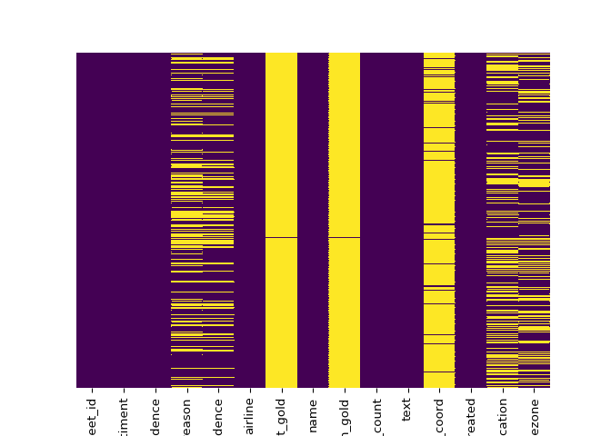
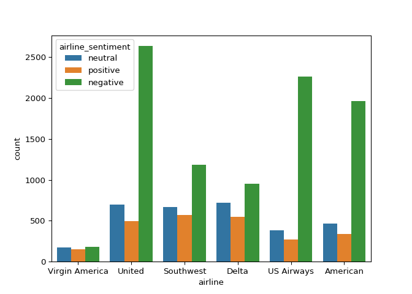
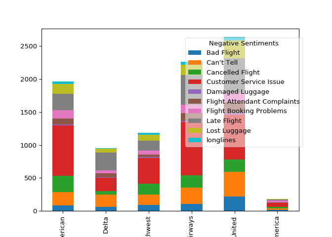
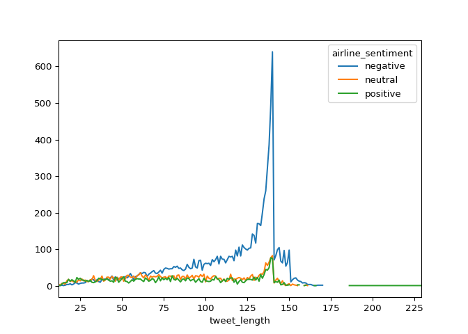

Twitter Airline Sentiment Analysis (ULMfit Sentiment)
================
Tosin Dairo
MAY 18, 2019

## Challenge

Application of a supervised ULMFiT model to Twitter US Airlines
Sentiment

<hr>

</hr>

## Dataset

The dataset of choice can be accessed on
[kaggle](https://www.kaggle.com/crowdflower/twitter-airline-sentiment#Tweets.csv)
which captures sentiment from experinced problems of major U.S.
airlines. The data sourced from twitter was scraped from February of
2015 and contributors were asked to first classify positive, negative,
and neutral tweets.

## Model Choice

In order to attain sentiment analysis, which is a branch of Natural
Language Processing, we adopt the use of a deep learning pretrained
model called ULMfit. \> Why Deep Learning? Compared to other machine
learning models, deep learning enables us to attain higher model
accuracy in classification, as well as a faster output considering the
data size. \> Why ULMfit? ULMfit is a pre-trained language model which
was trained with the use of Wikitext dataset and fastai library, in
order to achieve effective text classification with deep learning. This
pre-trained model enables us to achieve transfer learning.

## Environment Setup

In order to effectively execute this challenge, the following tools are
used - R; for Documentation, Exploratory Data Analysis and Preprocessing
using reticulate package and Python regular expressions. -Google Colab;
in order to achieve a fast output considering time of training as a
factor, we adopt the use of GPU processors provided by google on colab
notebooks.

<hr>

</hr>

## Exploratory Data Analysis

In this step, we would explore data missingness, distribution and
sentiment class usage through graphical or visual representations which
can be seen in the plots below. In order to effectively extract
insights, we adopt the use of Matplotlib and Seaborn packages. The goal
of this process is to enable us understand our data better so as to
pre-process effectively before applying our selected model.

``` python
d.head()
```

    ##              tweet_id  ...               user_timezone
    ## 0  570306133677760513  ...  Eastern Time (US & Canada)
    ## 1  570301130888122368  ...  Pacific Time (US & Canada)
    ## 2  570301083672813571  ...  Central Time (US & Canada)
    ## 3  570301031407624196  ...  Pacific Time (US & Canada)
    ## 4  570300817074462722  ...  Pacific Time (US & Canada)
    ## 
    ## [5 rows x 15 columns]

### Checking for missing data

Considering the goal is to fit a model for sentiment analysis, then
visualized missing values in certain varible would be of less
concern.

``` python
sns.heatmap(d.isnull(),yticklabels=False,cbar=False,cmap='viridis') 
```

<!-- -->

### Checking frequency of each class of sentiment

``` python
sns.countplot(x='airline', data = d, hue='airline_sentiment')
```

<!-- -->

### Checking the frequency of common negative words used by passengers on various airlines

The plot below shows that united airlines had passengers that were not
pleased after their experinces on board.

``` python
pd.crosstab(d.airline, d.negativereason).plot(kind='bar', stacked=True)
plt.legend(bbox_to_anchor=(1.05, 1),title='Negative Sentiments',loc =1,fancybox=True, framealpha=0.5,borderaxespad=1.4)
```

<!-- -->

### Checking tweet length for each class of sentiments

This showed that passengers mostly had higher text or tweet length when
giving negative comments.

``` python
d['tweet_length'] = d['text'].apply(len)
d.groupby(['tweet_length', 'airline_sentiment']).size().unstack().plot(kind='line', stacked=False)
```

<!-- -->

#### This involves the addition on new column label for the 3 classes of sentiment, in order to train the model considering the text representation cannot be passed through the training process.

``` python
def label(x):
    if x=='positive':
        return 1
    elif x=='neutral':
        return 0
    return -1
d['label']=d['airline_sentiment'].apply(label)
d.head()
```

    ##              tweet_id airline_sentiment  ...  tweet_length label
    ## 0  570306133677760513           neutral  ...            35     0
    ## 1  570301130888122368          positive  ...            72     1
    ## 2  570301083672813571           neutral  ...            71     0
    ## 3  570301031407624196          negative  ...           126    -1
    ## 4  570300817074462722          negative  ...            55    -1
    ## 
    ## [5 rows x 17 columns]

## Pre-processing techniques

In order to effectively train our language model before training our
classifier, we have to effectively pre-process our text data in order to
get rid of usernames, hashtags, emoji, adopt a unified capitalization,
remove numbers and finally punctuations. This can be best achieve with
the use of regular
expressions.

``` python
d['text'] = d['text'].apply((lambda x: re.sub(r'@\w+', '',x))) # remove mentions

d['text'] = d['text'].apply((lambda x: re.sub('[^a-zA-Z0-9,;:!?.\s]','',x))) # remove emoji

d['text'] = d['text'].apply((lambda x: re.sub(':\)|;\)|:-\)|\(-:|:-D|=D|:P|xD|X-p|\^\^|:-*|\^\.\^|\^\-\^|\^\_\^|\,-\)|\)-:|:\'\(|:\(|:-\(|:\S|T\.T|\.\_\.|:<|:-\S|:-<|\*\-\*|:O|=O|=\-O|O\.o|XO|O\_O|:-\@|=/|:/|X\-\(|>\.<|>=\(|D:', '',x))) # remove more emoji

#d['text'] = d['text'].apply((lambda x: ''.join([i for i in x if not i.text.lower()]))) # turn tweets to lowercase

d['text'] = d['text'].apply((lambda x: re.sub(r'#([^\s]+)', r'\1', x))) # remove hashtags

d['text'] = d['text'].apply((lambda x: ''.join([i for i in x if not i.isdigit()]))) # remove numbers

d['text'].head(10)
```

    ## 0                                          What  said.
    ## 1     plus youve added commercials to the experienc...
    ## 2     I didnt today... Must mean I need to take ano...
    ## 3     its really aggressive to blast obnoxious ente...
    ## 4              and its a really big bad thing about it
    ## 5     seriously would pay  a flight for seats that ...
    ## 6     yes, nearly every time I fly VX this ear worm...
    ## 7     Really missed a prime opportunity for Men Wit...
    ## 8                         Well, I didntbut NOW I DO! D
    ## 9     it was amazing, and arrived an hour early. Yo...
    ## Name: text, dtype: object

#### Create a new dataset which contains pre-processed tweets and labels.

``` python
d_air = pd.DataFrame(d[['label','text']])
d_air.head()
```

    ##    label                                               text
    ## 0      0                                        What  said.
    ## 1      1   plus youve added commercials to the experienc...
    ## 2      0   I didnt today... Must mean I need to take ano...
    ## 3     -1   its really aggressive to blast obnoxious ente...
    ## 4     -1            and its a really big bad thing about it

``` python
d_air.shape
```

    ## (14640, 2)

``` python
# Converting new dataframe into a CSV File
d_air.to_csv('/Users/lade/Dev/myOpenSet/texts.csv', index=False)
```

As you can see in [ULMfit model](/ULMfit.ipynb), after unfreezing and
retrain through 10 epoch we get 

And the learning rate of the initial fit can be visualised as 

In order to classify and carry out the sentiment analysis, fine tuned
language model is stored and imported on the [Sentiment classifier
notebook](/Sentiment_classifier.ipynb).

After fine tuning and optimizing, the final model came out to be 81.77%
accurate 

After achieving a high accuracy, random predictions of the were mad with
the model in order to see how well the model classifies the various
classes of sentiment. 

<div class="danger">

## Conclusion

As seen above, the deep learning pre-trained model developed by fastai
enable the rapid sentiment analysis of the task as it provide a fast
pipeline which does most of the deep learning process behind the scene
and produces a very efficient result.

</div>
